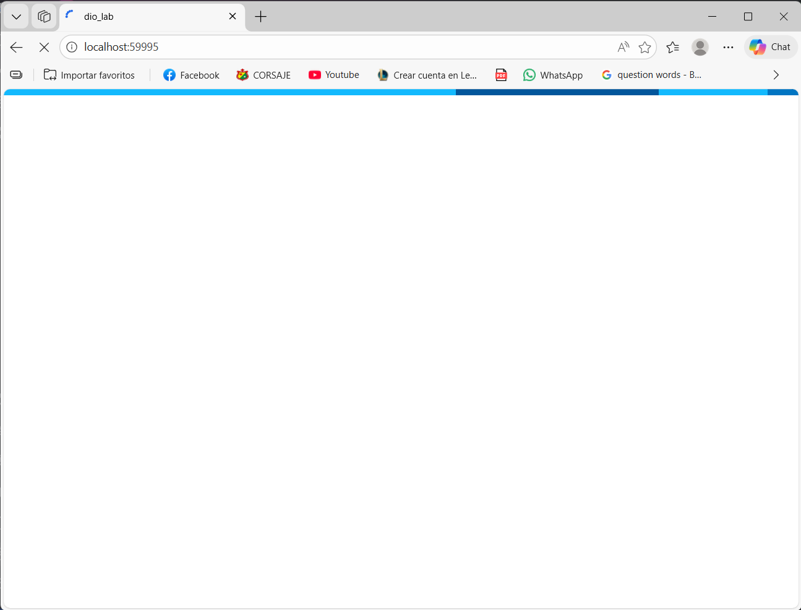
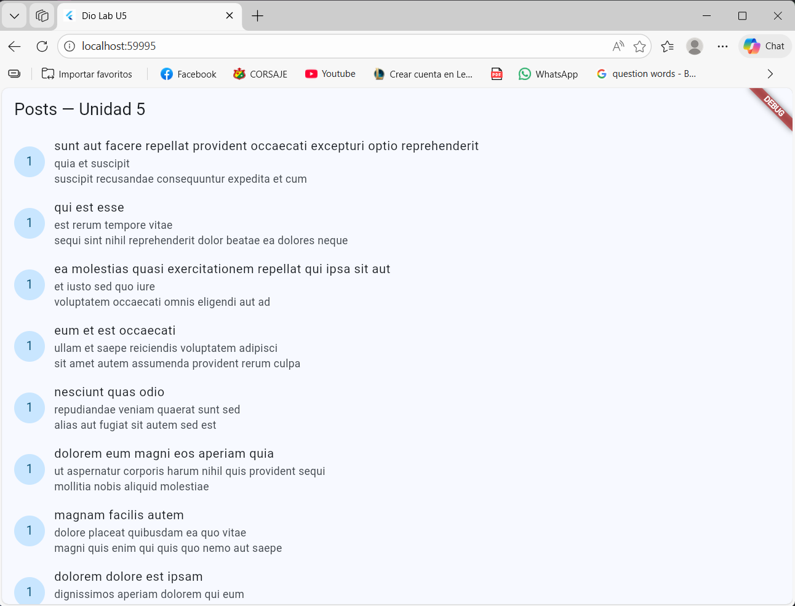
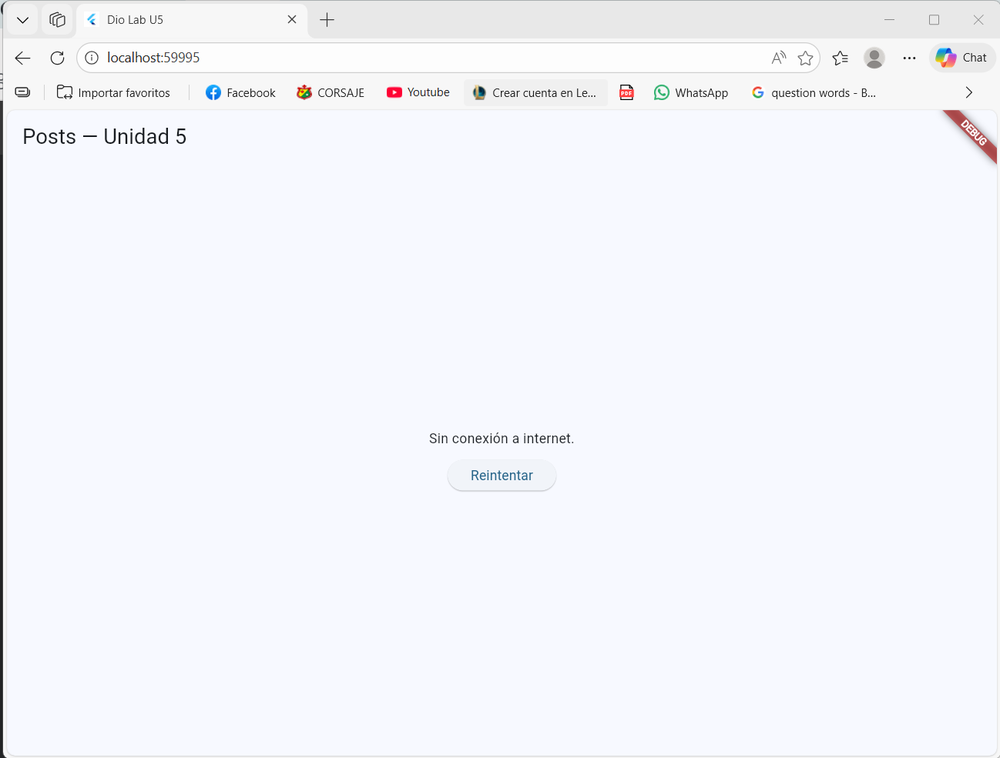

# Dio Lab - Consumo de API con Dio + Riverpod

Aplicacion Flutter que consume `https://jsonplaceholder.typicode.com/posts` usando:

- `dio` para networking
- `flutter_riverpod` para estado
- mapeo `DTO -> dominio`
- paginacion + pull-to-refresh
- manejo de errores tipado

## Requisitos

- Flutter SDK compatible con `Dart ^3.11.4` (ver `pubspec.yaml`)
- Android Studio o VS Code con Flutter/Dart plugins
- Emulador Android/iOS o dispositivo fisico
- Conexion a internet

## Configuracion

1. Clonar o abrir este proyecto en tu IDE.
2. Instalar dependencias:

```powershell
flutter pub get
```

3. Ejecutar la app:

```powershell
flutter run
```

4. (Opcional) Ejecutar analisis estatico:

```powershell
flutter analyze
```

## Flujo implementado

1. La app inicia en `lib/main.dart` con `ProviderScope` y abre `PostsScreen`.
2. `postsProvider` crea un `Dio` configurado (`baseUrl`, timeouts, headers, interceptores) en `lib/data/remote/network/dio_client.dart`.
3. `PostService` solicita `/posts` con `?_page` y `?_limit=15` en `lib/data/remote/service/post_service.dart`.
4. La respuesta se parsea a `PostDto`, luego se transforma a `Post` (dominio) con `toDomain()`.
5. `PostsNotifier` controla:
   - carga inicial (`build -> _fetchPage(1)`)
   - paginacion infinita (`fetchNextPage`)
   - pull-to-refresh (`refresh`)
6. En errores de red/HTTP, `DioException` se mapea a `AppError` y la UI muestra mensaje + boton de reintento.

## Capturas de pantalla

> Fuente de imagenes: carpeta `capturas/`

### 1) Pantalla de carga



### 2) Lista de posts cargada



### 3) Estado de error con reintento



## Estructura principal

- `lib/data/remote/network/`: cliente Dio
- `lib/data/remote/service/`: consumo de endpoints y mapeo de errores
- `lib/data/remote/dto/`: modelos de transporte (DTO)
- `lib/domain/model/`: modelos de dominio
- `lib/presentation/providers/`: estado y logica de UI
- `lib/presentation/screens/`: pantallas
